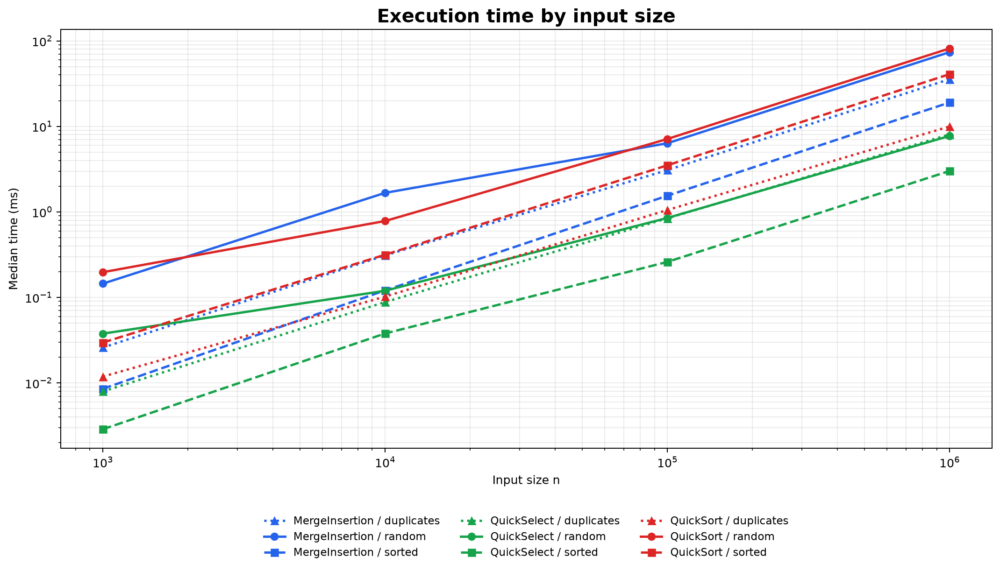
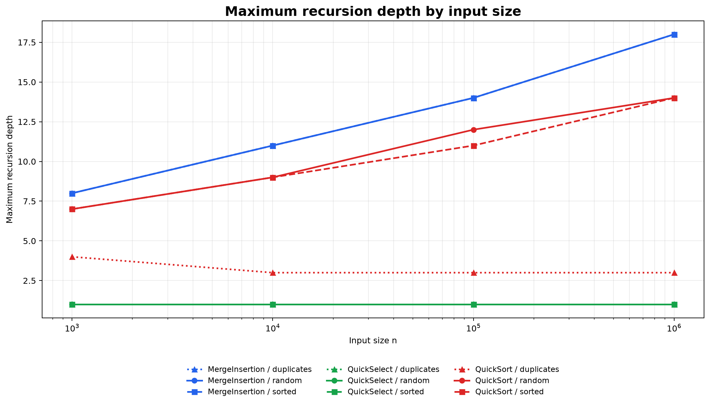
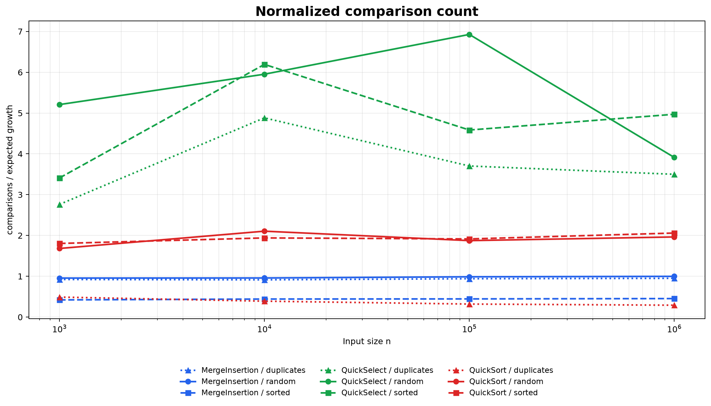

# Assignment 1 Report: Divide and Conquer

## 1. Implementation overview

The project contains a hybrid MergeSort (`MergeInsertion`), a randomized
QuickSort, and QuickSelect for integer arrays. MergeInsertion allocates one
helper buffer in its public entry point and reuses it throughout recursion.
Segments of 15 elements or fewer are handled by Insertion Sort. QuickSort and
QuickSelect share a Dutch National Flag partition that produces three regions:
elements smaller than the pivot, elements equal to it, and elements greater
than it. The pivot is selected randomly on every partition.

QuickSort recursively processes only the smaller outer region and handles the
larger region with a loop. Consequently, even an unlucky sequence of pivots
cannot create a linear Java call stack. QuickSelect is completely iterative and
continues only in the region containing the requested zero-based position.

The `Metrics` object is passed explicitly into every algorithm. It records
element comparisons, maximum recursion depth, and elapsed time measured with
`System.nanoTime()`. Input generation and array cloning are outside the timed
region. A fixed random seed makes the benchmark data reproducible.

## 2. Asymptotic bounds

All bounds in the table are tight, so Θ notation is used. The cutoff at 15
changes constants but not the asymptotic bounds of MergeSort.

| Algorithm | Best case | Average case | Worst case |
|---|---|---|---|
| MergeInsertion | Θ(n log n): both halves are processed and merged even when the input is already sorted. | Θ(n log n): balanced halving creates log n levels with Θ(n) work per level. | Θ(n log n): reverse or random order changes comparisons but not the balanced recursion tree. |
| QuickSort | Θ(n log n): pivots repeatedly produce balanced outer regions. | Expected Θ(n log n): a random pivot gives sufficiently balanced partitions on average. | Θ(n²): every chosen pivot is repeatedly an extreme value, producing partitions of sizes 0 and n−1. |
| QuickSelect | Θ(n): partitioning scans the current n-element range once and k immediately enters the equal region. | Expected Θ(n): only one partition side is retained, producing the geometric sum n + n/2 + n/4 + …. | Θ(n²): repeated extreme pivots retain ranges n−1, n−2, … before reaching k. |
| Insertion Sort | Θ(n): an already sorted segment needs one failed comparison per inserted element. | Θ(n²): a typical element moves across a linear fraction of the preceding segment. | Θ(n²): reverse order moves every element across the whole sorted prefix. |

QuickSort still has a theoretical quadratic worst case because randomized
choice changes probability, not possibility. Three-way partitioning makes
duplicate-heavy input much faster because the entire equal region is completed
after one partition.

## 3. Recurrence relations

### 3.1 MergeSort

For inputs above the cutoff:

```text
T(n) = 2T(n/2) + Θ(n)
a = 2, b = 2, f(n) = Θ(n)
n^(log_b(a)) = n
```

Here `f(n) = Θ(n^(log_b(a)))`, so Master Theorem case 2 applies and
`T(n) = Θ(n log n)`. Replacing small leaves with Insertion Sort only changes a
constant-size base case.

### 3.2 QuickSort with a balanced split

```text
T(n) = 2T(n/2) + Θ(n)
a = 2, b = 2, f(n) = Θ(n)
```

Master Theorem case 2 again gives `T(n) = Θ(n log n)`. A random pivot does not
guarantee a balanced split in one call, but its rank is uniformly distributed.
Across the recursion tree, the expected total partition work is therefore
`O(n log n)` rather than the `Θ(n²)` produced by a persistent extreme pivot.

### 3.3 QuickSelect with a balanced retained side

```text
T(n) = T(n/2) + Θ(n)
a = 1, b = 2, f(n) = Θ(n)
n^(log_b(a)) = 1
```

The linear partition term is polynomially larger than 1 and satisfies the
regularity condition, so Master Theorem case 3 gives `T(n) = Θ(n)`. This differs
from QuickSort because the second partition side is discarded rather than
recursively processed.

Insertion Sort uses `T(n) = T(n−1) + Θ(1)` in the best case and
`T(n) = T(n−1) + Θ(n)` in the worst case. These are not Master Theorem
recurrences; expanding them gives Θ(n) and Θ(n²), respectively.

## 4. Experimental method

Each algorithm was measured for `n = 1,000`, `10,000`, `100,000`, and
`1,000,000`. The three input types were unrestricted random integers, sorted
integers, and duplicate-heavy arrays containing values from 0 to 9. Every case
was executed five times, and the complete run whose time was the median was
stored in `results.csv`. QuickSelect selected position `n/2`. Comparisons count
only comparisons between array values; loop bounds and index checks are not
included.

The test suite also checks QuickSort on a sorted array of 100,000 elements. The
smaller-side-first transformation keeps its measured call-stack depth below
`2·log₂(n)`, independently of whether the random partitions are balanced.

## 5. Results and plots



The time chart uses logarithmic axes because both the input sizes and measured
times span several orders of magnitude. At one million random values,
MergeInsertion took approximately 73.88 ms, QuickSort 81.65 ms, and QuickSelect
7.74 ms. Exact timings depend on the machine and JVM state, so the trend is more
important than an individual value.



MergeInsertion depth grows predictably with log₂(n), reaching 18 at one
million elements. QuickSort remained at or below 14 in the recorded runs,
including sorted input. Duplicate-heavy QuickSort required only three or four
levels because equal keys are removed as one central region. Iterative
QuickSelect has constant measured depth 1.



For the sorting algorithms, the ratio is `comparisons / (n·log₂(n))`. For
QuickSelect, it is `comparisons / n`. A ratio that stays within a stable range
is empirical evidence for the expected Θ bound.

## 6. Empirical Θ check

Using all recorded inputs with `n ≥ n₀ = 10,000`, the observed comparison counts
satisfy the following empirical bounds. These constants summarize this dataset;
they are not a mathematical proof for every possible input.

| Algorithm | g(n) | c₁ | c₂ | n₀ |
|---|---:|---:|---:|---:|
| MergeInsertion | n log₂(n) | 0.442 | 0.998 | 10,000 |
| QuickSort | n log₂(n) | 0.291 | 2.105 | 10,000 |
| QuickSelect | n | 3.499 | 6.927 | 10,000 |

Thus the measured values obey `c₁·g(n) ≤ comparisons ≤ c₂·g(n)` for the tested
points at and above `n₀`. MergeInsertion has the most stable normalized ratio.
QuickSort is stable on random and sorted data, while its ratio decreases on
duplicate-heavy arrays because three-way partitioning can approach linear work
when the number of distinct keys is bounded. QuickSelect has wider variation
because each run follows a random sequence of only one-sided partitions, but
its comparison count remains a small constant multiple of n.

## 7. Discussion

The measurements broadly match the theoretical bounds. MergeInsertion exhibits
the expected `n log n` comparison growth and logarithmic depth. Randomized
QuickSort also scales near `n log n`, while smaller-side recursion keeps its call
stack bounded even on sorted input. Three-way partitioning makes duplicate-heavy
QuickSort noticeably faster than its general `n log n` expectation. QuickSelect
is fastest when only one order statistic is required because it discards one
side after every partition. The five-run median reduces, but cannot eliminate,
JVM warm-up and operating-system scheduling noise. Garbage collection has
limited impact because the algorithms reuse arrays and the timed region excludes
benchmark input generation. CPU cache effects and the 15-element insertion
cutoff help explain why time ratios are less smooth than comparison ratios.
